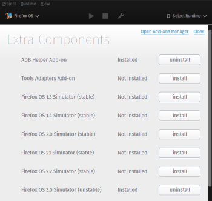

class: center, middle
# Firefox OS Apps erstellen in wenigen Minuten

---

# Agenda

1. Schnell-Einführung in Firefox OS
2. Einrichtung für die Entwicklung
3. Eine fertige App installieren
4. Eine statische Mini-App erstellen
5. Eine bestehende App portieren

---

class: center, middle
# Schnell-Einführung in Firefox OS

---

# Der Marketplace
Von hier können sich Benutzer Apps herunterladen, ähnlich wie aus dem Google Play Store unter Android.

---

class: center, middle
# Einrichtung für die Entwicklung

---

1. Firefox Developer Edition installieren
2. Firefox öffnen und WebIDE starten (F8)

3. Menü: Project &rarr; Manage Extra Components
  - Firefox OS 3.0 Simulator installieren
  - ggf. ADB Helper Add-on installieren
4. Runtime auswählen (Runtime &rarr; Firefox OS 3.0)
