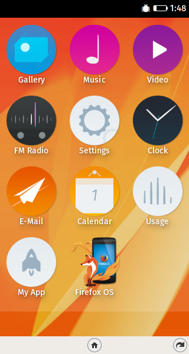

class: center, middle

# Firefox OS Apps erstellen in wenigen Minuten


## Daniel Maslowski |  @orangecms |  orangecms

---

# Agenda

1. Schnell-Einführung in Firefox OS
2. Einrichtung für die Entwicklung
3. Eine fertige App installieren
4. Eine statische Mini-App erstellen
5. Eine bestehende App portieren

---

class: center, middle
# Schnell-Einführung in Firefox OS

---

## Der Marketplace

Von hier können sich Benutzer Apps herunterladen, ähnlich wie aus dem Google Play Store unter Android.


---

class: center, middle
# Einrichtung für die Entwicklung


---

## Firefox Developer Edition

1. WebIDE starten (F8)
2. Menü: Project &rarr; Manage Extra Components


---

## Simulator

1. Firefox OS 3.0 Simulator installieren
2. Simulator starten (Simulators &rarr; Firefox OS 3.0)


---

class: center, middle


---

## Reale Geräte

### Auf dem Gerät die [Developer Settings](https://developer.mozilla.org/en-US/docs/Mozilla/Firefox_OS/Debugging/Developer_settings) und Debug-Modi aktivieren

--

### WebIDE
- via USB:
  1. ADB Helper Add-on installieren
  2. Runtime auswählen (Runtime &rarr; Firefox OS 3.0)

- via Wi-Fi:
  1. Valence installieren (im Bundle mit Developer Edition)
  2. Runtime auswählen (Wi-Fi &rarr; Geräte-ID)

--

### Auf dem Gerät den Zugriff zulassen

---

class: center, middle
# Eine fertige App installieren

---

## Projekt in WebIDE öffnen

- Open Packaged App...


---

## Projekt installieren und starten

- Play-Button drücken :)


---

class: center, middle




---

class: center, middle
# Eine statische Mini-App erstellen

---

## Mindestbestandteile einer App

1. `webapp.manifest` (Meta-Informationen der App)
2. HTML-Datei (die eigentliche App)
3. Icons (für den Launcher / Homescreen)

---

## `webapp.manifest`

```json
{
  "version": "0.0.1",
  "name": "Firefox OS",
  "description": "presentation for FFOS workshop at ORR2015",
  "launch_path": "/src/index.html",
  "icons": {
    "16": "/img/icons/icon16x16.png",
    "48": "/img/icons/icon48x48.png",
    "60": "/img/icons/icon60x60.png",
    "128": "/img/icons/icon128x128.png"
  },
  "developer": {
    "name": "Daniel Maslowski",
    "url": "http://orangecms.org"
  },
  "type": "privileged",
  "installs_allowed_from": [
    "*"
  ],
  "default_locale": "en"
}
```

---

## HTML-Datei und Icons

- `/src/index.html`
```html
<!DOCTYPE HTML PUBLIC "-//W3C//DTD HTML 4.01//EN"
   "http://www.w3.org/TR/html4/strict.dtd">
<HTML>
   <HEAD>
      <TITLE>HTML Demo</TITLE>
   </HEAD>
   <BODY>
      <P>Hallo OpenRheinRuhr!</P>
   </BODY>
</HTML>
```

--

- Icons in verschiedenen Größen
```bash
$ ls -l img/icons/
total 40
-rw-r--r-- 1 shopco shopco 18493 Nov  6 06:00 icon128x128.png
-rw-r--r-- 1 shopco shopco  1217 Nov  6 06:00 icon16x16.png
-rw-r--r-- 1 shopco shopco  4397 Nov  6 06:00 icon48x48.png
-rw-r--r-- 1 shopco shopco  6132 Nov  6 06:00 icon60x60.png
```

---

class: center, middle
# Eine bestehende App portieren

---
