class: center, middle

# Creating Firefox OS Apps in a Couple of Minutes

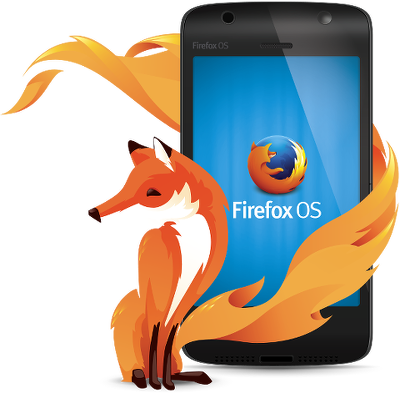

Daniel Maslowski |  @orangecms |  orangecms

---

# Agenda

1. Quick introduction to Firefox OS
2. Setting up for development
3. Installing an existing app
4. Creating a static app
5. Porting existing web apps
6. Debugging with the Developer Tools

---

class: center, middle
# Quick introduction to Firefox OS

---

## The UI

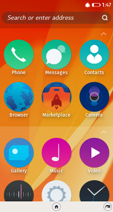
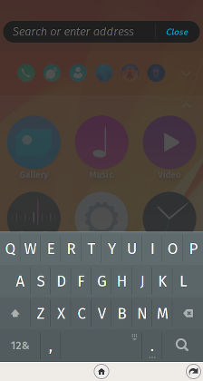
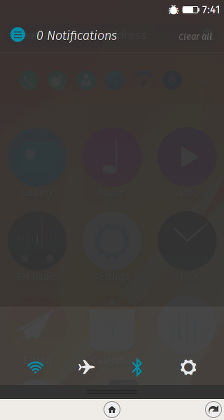

---

## The Marketplace

From here, users can download apps, similar to the Google Play Store on Android.


Developers can [publish their apps](https://developer.mozilla.org/en-US/Marketplace) on this platform.

---

class: center, middle
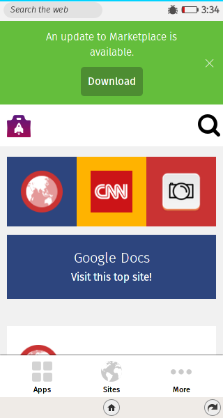
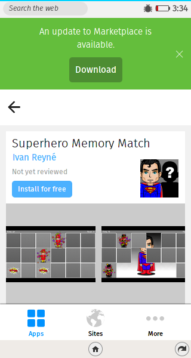

---

class: center, middle
# Setting up for development


---

## Firefox Developer Edition

1. Open the WebIDE (Shift + F8)
2. Menu: Project &rarr; Manage Extra Components

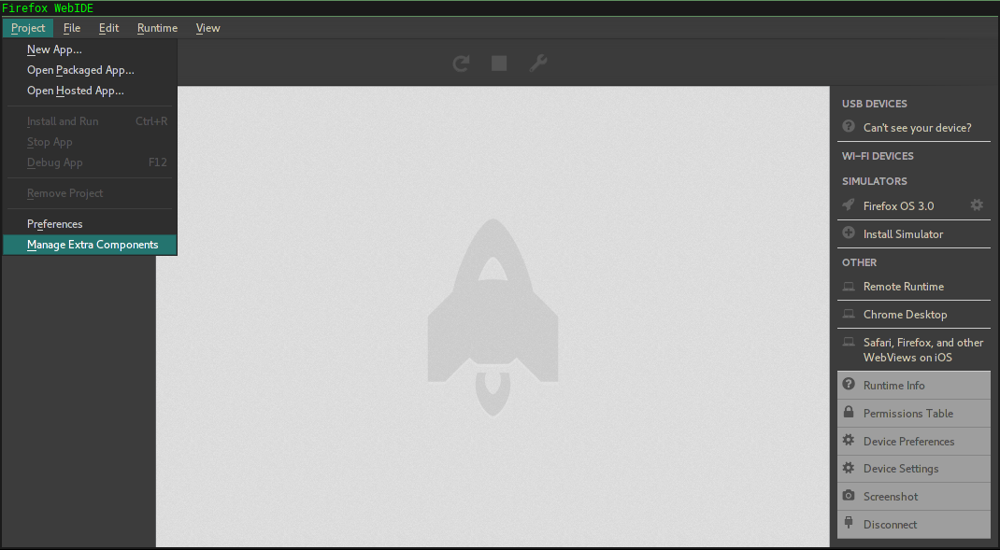

---

## Simulator

1. Install the Firefox OS 3.0 Simulator
2. Start the simulator (Simulators &rarr; Firefox OS 3.0)

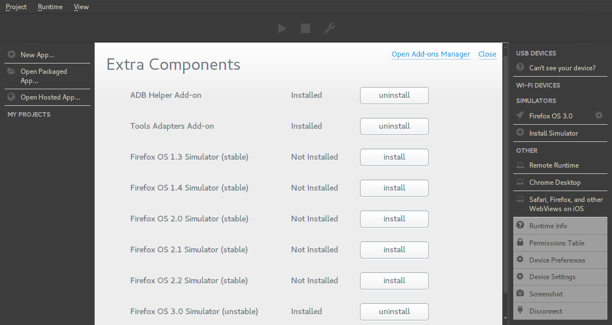

---

## Real devices

### On the device, [activate Debug Mode](https://developer.mozilla.org/en-US/docs/Mozilla/Firefox_OS/Debugging/Developer_settings)

--

### WebIDE
- via USB:
  1. Install the ADB Helper Add-on
  2. Choose the runtime (Runtime &rarr; Firefox OS 3.0)

- via Wi-Fi:
  1. Install Valence (bundled with Developer Edition)
  2. Choose the runtime (Wi-Fi &rarr; Device ID)

--

### Allow access on the device

---

class: center, middle
# Installing an existing app

---

## Open the project in WebIDE

- Open Packaged App...

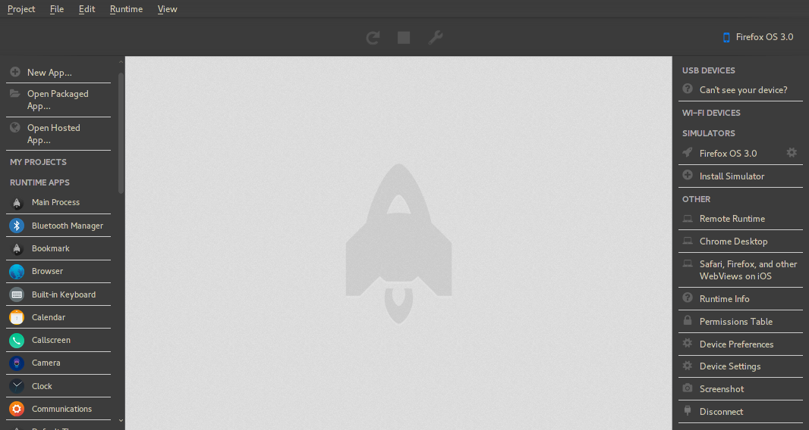

---

## Install and run the project

- Push the play button ▶

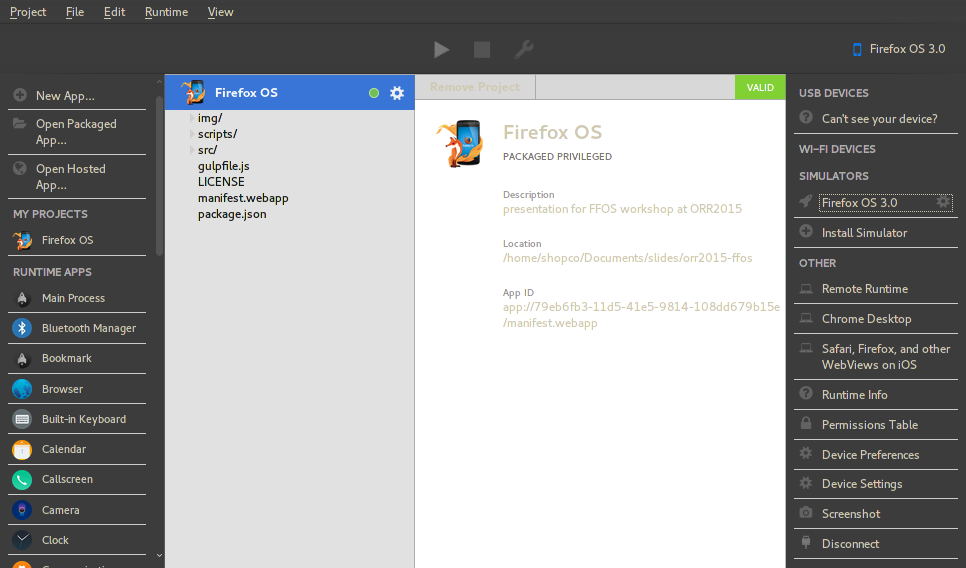

---

class: center, middle

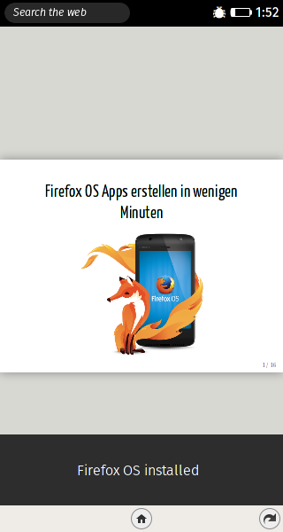
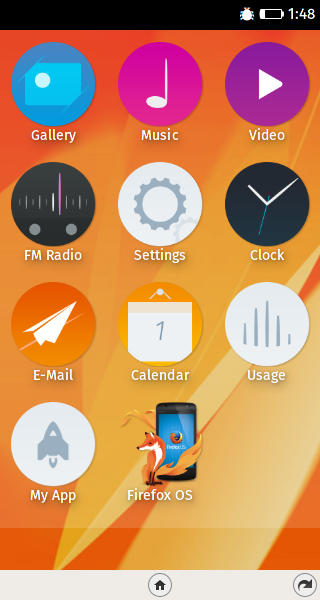

---

class: center, middle
# Creating a static app

---

## Minimum set of files comprising an app

1. `webapp.manifest` (meta information of the app)
2. HTML file (the actual app)
3. Icons (for the launcher / home screen)

---

## `webapp.manifest`

```json
{
  "version": "0.0.1",
  "name": "Firefox OS",
  "description": "FxOS workshop at 32C3",
  "launch_path": "/src/index.html",
  "icons": {
    "16": "/img/icons/icon16x16.png",
    "48": "/img/icons/icon48x48.png",
    "60": "/img/icons/icon60x60.png",
    "128": "/img/icons/icon128x128.png"
  },
  "developer": {
    "name": "Daniel Maslowski",
    "url": "http://orangecms.org"
  },
  "type": "privileged",
  "installs_allowed_from": [
    "*"
  ],
  "default_locale": "en"
}
```

---

## HTML File and icons

- `/src/index.html`
```html
<!DOCTYPE HTML PUBLIC "-//W3C//DTD HTML 4.01//EN"
   "http://www.w3.org/TR/html4/strict.dtd">
<HTML>
   <HEAD>
      <TITLE>HTML Demo</TITLE>
   </HEAD>
   <BODY>
      <P>Hallo 32C3!</P>
   </BODY>
</HTML>
```

--

- Icons in multiple sizes
```bash
$ ls -l img/icons/
total 40
-rw-r--r-- 1 shopco shopco 18493 Nov  6 06:00 icon128x128.png
-rw-r--r-- 1 shopco shopco  1217 Nov  6 06:00 icon16x16.png
-rw-r--r-- 1 shopco shopco  4397 Nov  6 06:00 icon48x48.png
-rw-r--r-- 1 shopco shopco  6132 Nov  6 06:00 icon60x60.png
```

---

class: center, middle
# Porting existing web apps

---

## necessary modifications

- Check out the [Mozilla Developer Network](https://developer.mozilla.org/en-US/Apps/Quickstart/Build/Your_first_app) :)

--

- create [`webapp.manifest`](https://developer.mozilla.org/en-US/Apps/Build/Manifest)

--

- provide your entry point (e.g. `index.html`) as the `"launch_path"` in `webapp.manifest`

--

- create icons and add them to `webapp.manifest`

--

- adjust [XHR objects](https://developer.mozilla.org/en-US/docs/Web/API/XMLHttpRequest)
  1. in `webapp.manifest`:
    ```json
      "permissions": {
          "systemXHR": {}
      }
    ```
  2. create with `new window.XMLHttpRequest({ mozSystem: true })`

--

- adjust CSP, if necessary
  - CSP cannot be dropped or lowered, only hardened

---

class: center, middle
# Debugging with the Developer Tools

---

## Inspector in WebIDE

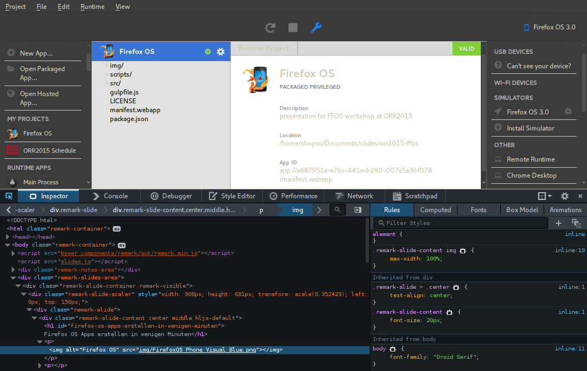

---

class: center, middle
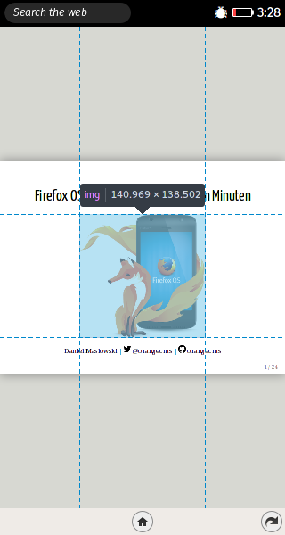

---

class: center, middle
# Thanks, that's it! 😸
